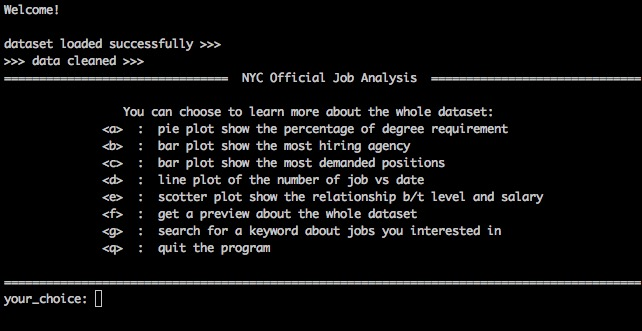
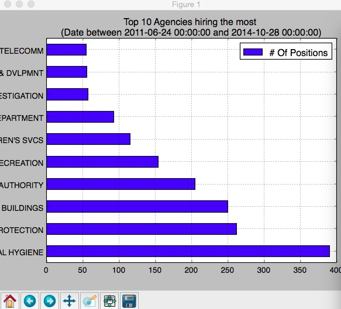
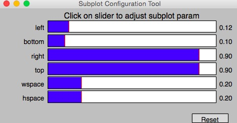
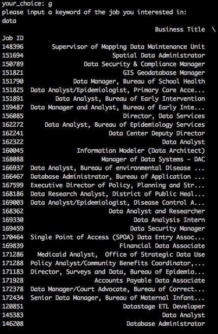
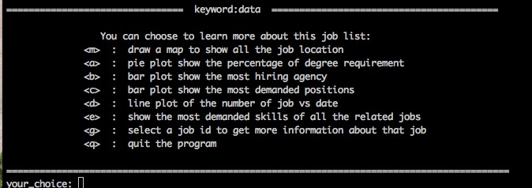
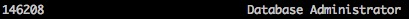
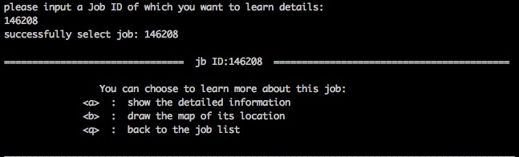
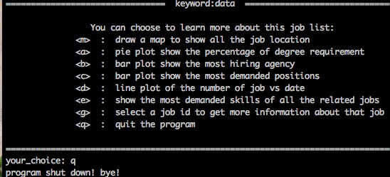

DS-GA1007 Final Project User Guide
NYC Official Job data Analysis with Visualization 
======================

## Table of Contents
* [How to run the program](#How-to-run-the-program?)
* [What input the program takes](#what-input-the-program-takes?)
* [What output the program produces](#What output the program produces?)
* [demo](#An typical walk-through example)

####What does the program do? 
This program provides user the overall view of NYC Official Job Dataset in the most recent years through Data Visualization and brief job information listing. 
At the beginning of program, a list of options will be display for user. For example, user could choose to plot a pie that shows the percentage of jobs that needed at least a high school diploma, bachelor degree and master degree. In additions to plotting a graph to visualize the data, user could also choose to search jobs by entering keyword,then choose to learn more about the specific job by using provided job IDs.


####How to run the program?
User could use either Terminal (Mac/Unix/Linux user) or Command Prompt (Window user) run the program. If user uses Mac Terminal, user could just change the terminal directory to directory where the program documents saved, then type ```python main.py``` in Terminal. For window user, user could use Python Launcher for window, assuming user using python 2.7, user could type ```py  main.py``` in the Command Prompt after changing the directory to where the program saved. 

####What input the program takes?
Program takes options inputs like a, b, c etc. from the option list program provided at the beginning of the program. Program could also take a keyword input from user if user would like to search the job by keyword. 

###What output the program produces?
Program could generate different kind of plots or even a piece of Google map upon user’s request. In addition, if user searches jobs by using keyword, the program may print out a list of available jobs, or a specific job with important information in detail. 

###An typical walk-through example
```
	The following example is demonstrated in Mac Terminal.
	Assuming your terminal has changed to the directory where the program saved
	and has python 2.7 available.
```
1.	To run the program just type `python main.py` in terminal
2.	Content will be displayed as following: 


3.	From the options list above, assuming you want to know which government agencies hire the most,then we could select `b`. Then the bar-plot will pop-up: 


4.Since the vertical labels may not display properly above, you may want to clickin the bottom middle to adjust the display of graph.to have   

5.If you want to return to the program, just close the plot-image

6.After that, we could also search for jobs by entering a keyword:

	First select `g`, the program will ask you for a keyword input 
	assuming that you type a keyword like `data`, the list of available jobs with job ID will be displayed as following:



If you want to get more information about a specific job, select`g`again,
then the program will ask you input a job ID from the above list. 

Let see you are interested in a position like `Database Administrator`
 

Just enter the corresponding job id: `146208`
then you would see:
 

For those people whose are more conerned about where is the job located,by entering `b`
they may see A piece of Google map will pop up like:
 

After you close the map, you can chose `q` back to job list, then `q` again to quit the program. 
 

